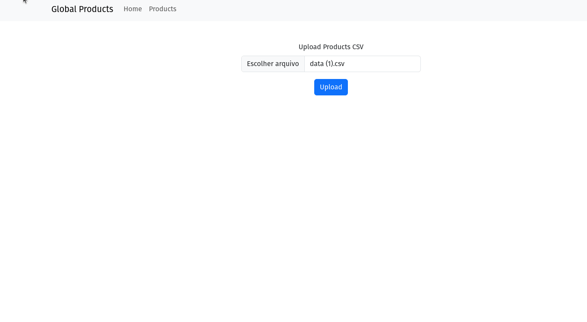

# Global Products Frontend Coding Test

Be sure to read **all** of this document carefully, and follow the guidelines within.

## Context

Implement a full-stack web or mobile application that can upload, process, and store into a database the following CSV filem which contains a list of products.

[CSV File](https://github.com/flatironsdevelopment/rails_node_test/raw/main/data.csv)

## Technology Choice
1. Backend: Ruby on Rails
2. Frontend: React (for web candidates)

## Requirements - Backend
 - [Backend Repository](https://github.com/NelcifranMagalhaes/global_product_backend)
1. The products should be stored along with multiple exchange rates at the time of the upload utilizing this [API](https://github.com/fawazahmed0/exchange-api) (include at least 5 currencies). All product fields are required and must be present.
2. Implement an endpoint that returns all the processed rows of product data along with the available currency conversions stored at the time of the upload. This endpoint should support filtering and sorting based on the name, price, and expiration fields
4. The application should support CSV files with up to 200k rows.

## Requirements - Frontend
1. The front-end should display a file upload input that allows the user to select a CSV file from their device.
2. While the file is uploading and being processed, there should be a loading indicator displaying progress of the upload.
3. Once the file uploads, a success message should display and you should be able to browse a table of the uploaded products. 

